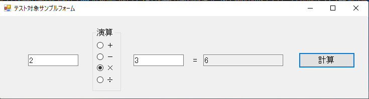
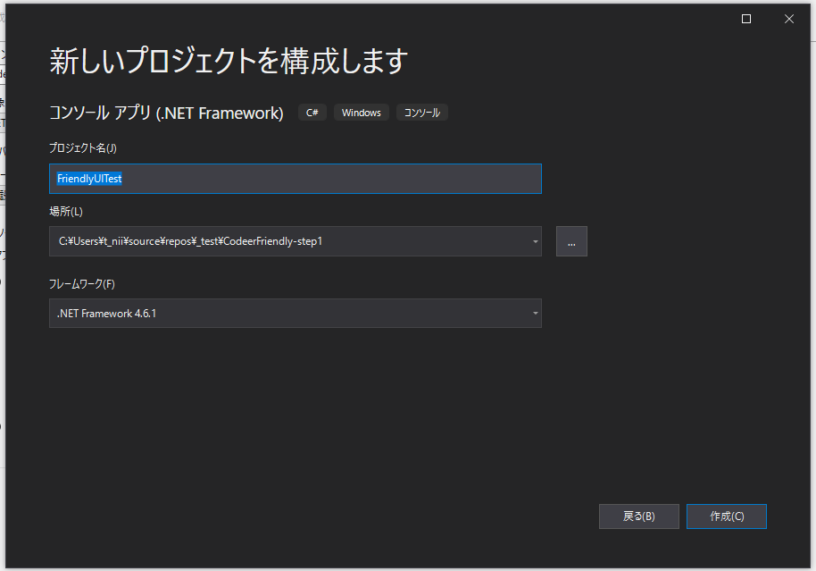
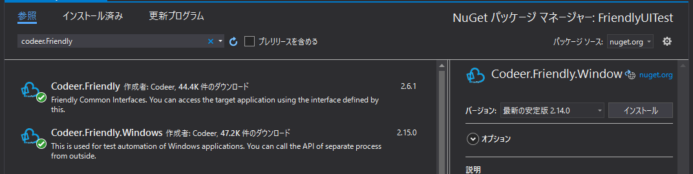

# Codeer Friendlyを使った .NET WinForms アプリケーションの操作

## Codeer Friendlyとは？

GUI操作ライブラリです。操作対象のプロセスにアタッチして、プロセス外から
コントロールの値設定や、ボタンクリックイベントなどを好き勝手できる素敵なライブラリです。
（本来はユニットテストや、自動操作のためのライブラリのようです)

* [https://github.com/Codeer-Software/Friendly](https://github.com/Codeer-Software/Friendly)

* [株式会社Codeer](https://www.codeer.co.jp/CodeAndTool)

## 環境

Visual Studio 2019で確認しています(VS2015以降であれば動くと思います)

## 目的

簡単なGUIアプリを外部から操作する最低限の動作サンプルを作ります。

マウスやキーボード(エミュレーションも)は使いません。

別プログラムから(コーディングで)「2」と「3」を入力後、「計算ボタン」のクリックイベントを発生させて、計算結果を表示させるところまで確認します。


* 動作確認後の画面イメージ
  

---

## 動作確認アプリ(TestTargetExeForm)

・四則演算をするだけのGUIアプリです

```csharp
using System;
using System.Windows.Forms;

namespace TestTargetExeForm
{
    public partial class TestTargetForm : Form
    {
        public TestTargetForm()
        {
            InitializeComponent();
        }


        delegate bool ParseText(TextBox t, out decimal v);

        private void button1_Click(object sender, EventArgs e)
        {
            decimal lhv = 0;
            decimal rhv = 0;
            decimal result = 0;

            ParseText parseText = (TextBox textbox, out decimal value) =>
            {
                if (!decimal.TryParse(textbox.Text, out value))
                {
                    MessageBox.Show("数値を入力してください", "入力エラー");
                    textbox.SelectAll();
                    textbox.Focus();
                    return false;
                }
                return true;
            };

            textBox3.Text = "";

            if (!parseText(textBox1, out lhv))
            {
                return;
            }

            if (!parseText(textBox2, out rhv))
            {
                return;
            }

            if (rdoAdd.Checked)
            {
                result = lhv + rhv;
            }
            else if (rdoSub.Checked)
            {
                result = lhv - rhv;
            }
            else if (rdoMul.Checked)
            {
                result = lhv * rhv;
            }
            else if (rdoDiv.Checked)
            {
                if (rhv == 0)
                {
                    result = 0;
                }
                else
                {
                    result = lhv / rhv;
                }
                
            }

            textBox3.Text = result.ToString();
        }
    }
}

```


## GUI操作アプリ（Friendly利用）

### 1:コンソールアプリケーションを追加




### 2:追加したプロジェクトを右クリックして「NuGetパッケージの管理」を選択

`codeer.Friendly`で検索して`Codeer.Friendly`と`Codeer.Friendly.Windows`の2つをインストールする。




### 3:プログラムを操作するコードを記載する

ポイントは

* usingでFriendlyを読み込む
* var targetApp = new WindowsAppFriend(process) でプロセスにアタッチする
* dynamic form = targetApp.Type<System.Windows.Forms.Application>().OpenForms[0]　で外部プロセスのフォームを取得する

  フォームが取得できれば、後は普通にコントロールを操作するイメージで操作ができます

```csharp
using System;
using Codeer.Friendly.Dynamic;
using Codeer.Friendly.Windows;

//nugetで下記をインストールしてからusingで読み込む
// Codeer.Friendly
// Codeer.Friendly.Windows


class Program{
    /// <summary>
    /// アプリケーションのメイン エントリ ポイントです。
    /// </summary>
    [STAThread]
    public static void Main()
    {
        //--- プロセス起動  操作対象プログラムのパスは適宜修正すること
        var path = System.IO.Path.Combine(Environment.CurrentDirectory, @"..\..\..\testExe\TestTargetExeForm.exe");
        var process = System.Diagnostics.Process.Start(path);

        //--- プロセスにアタッチ
        using (var targetApp = new WindowsAppFriend(process))
        {
            // フォームを取得
            dynamic form = targetApp.Type<System.Windows.Forms.Application>().OpenForms[0];

            // 2 * 3 を入力(別プロセスのテキストボックス、ラジオボタンに値が設定される)     
            form.textBox1.Text = "2";
            form.rdoMul.Checked = true;
            form.textBox2.Text = "3";

            // 計算ボタンをクリック
            form.button1.PerformClick();

            // 計算結果をデバッガに出力
            System.Diagnostics.Debug.WriteLine((string)form.textBox3.Text);
        }
    }
}
```

プログラムを起動した直後は各コントロールが空ですが、すぐに値が設定されることがわかります


